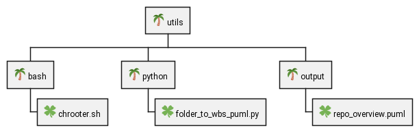
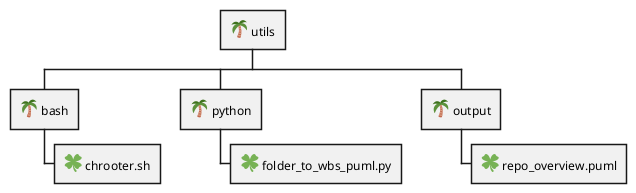

# General utilities that have no other home

## Current Utilities:

- [bash/chrooter.sh](bash/chrooter.sh) - useful to run from a live cd if you need to chroot into your root filesystem (for repair/rescue operations).  Mounts required directories, chroots into destination.

- [python/folder_to_wbs_puml.py](python/folder_to_wbs_puml.py) - generates a plantuml WBS structure of the specified folder (default is current folder).  I created this to help myself quickly visualize code organization in folders, and provide a starting point for myself to take notes on each folder.  Run `folder_to_wbs_puml.py -h` for options.

### folder_to_wbs_puml.py

Here's a sample run of the script on this repository in both plantuml and image format (you have to generate the image yourself using plantuml)

#### plantuml output

View this output code in [the plantuml live editor](http://www.plantuml.com/plantuml/duml/TOv12eGm34NtFOLh5nv0Xi6RXAef5Q89QQ9u-sct8-x22-_nfs9HxPfB27tt6INI3gQ8uxTpswY4_X_FiUHA6qxi2eGnmK9yejRlafNPK8UIdwhSblbubnFJYWh6K0U1-4w3tCyCkudRUqPH6DfzRdWDBHF2XCTQepy0)

#### image output

